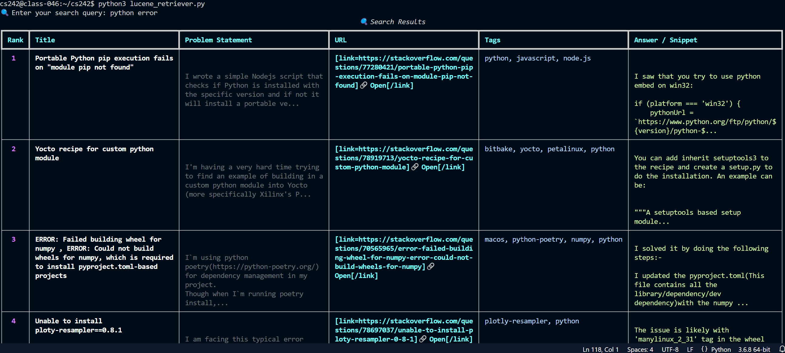

### Indexing

To index new files, run `lucene_indexer.py` with your json file(s).

### Retrieve / Search

To search retrieve, run `lucene_retriever.py`

 * Removed duplicates.
 * Priorise results with answers (> 1000).

 
